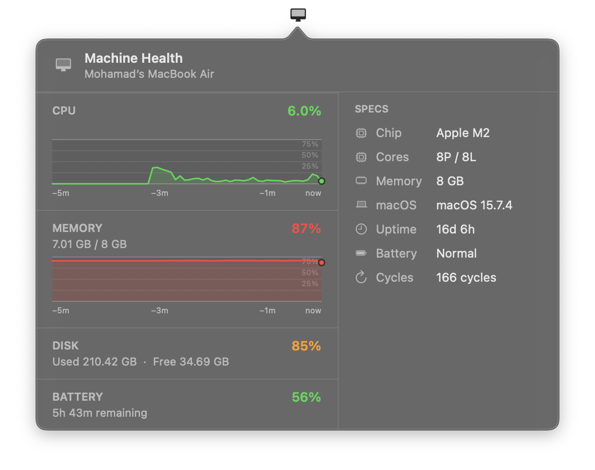

<div align="center">
  
  <h1>MachineHealth</h1>
  <p>A lightweight macOS menu bar app that keeps an eye on your machine's health — CPU, memory, disk, and battery — at a glance.</p>

  [](https://github.com/amzar96/MachineHealth/actions/workflows/swift-test.yml)
  [](https://github.com/amzar96/MachineHealth/releases/latest)
  [](https://github.com/amzar96/MachineHealth)
  [](LICENSE)
</div>

---

## Screenshot
<div align="center">

</div>

## Features

- **CPU** — live usage % with sparkline history graph
- **Memory** — used / total with colour-coded thresholds
- **Disk** — used / total at a glance
- **Battery** — charge %, health condition, and cycle count
- **Specs** — chip, cores, RAM, macOS version, and uptime
- **Notifications** — alerts when CPU or memory crosses critical thresholds
- **Appearance** — System / Light / Dark mode toggle
- Minimal footprint — ~1 MB bundle, pure AppKit, no dependencies

---

## Installation

### Homebrew (recommended)

```sh
brew tap amzar96/tap
brew install --cask machinehealth
```

> MachineHealth is not notarized by Apple. If macOS blocks it on first launch:
> - **Option 1** — System Settings → Privacy & Security → **Open Anyway**
> - **Option 2** — run `sudo xattr -dr com.apple.quarantine /Applications/MachineHealth.app`

### Build from source

Requires macOS 13+ and Swift 5.9+.

```sh
git clone https://github.com/amzar96/MachineHealth.git
cd MachineHealth
make bundle          # produces MachineHealth.app
make install         # copies to /Applications
```

---

## Usage

MachineHealth lives in your menu bar. Click the icon to open the popover.

| Section | What you see |
|---|---|
| CPU | Usage %, sparkline graph, warning / critical thresholds |
| Memory | Used vs total, usage % |
| Disk | Used vs total |
| Battery | Charge %, condition, cycle count |
| Specs | Chip, cores, RAM, macOS, uptime |

Open **Settings** (gear icon) to configure:
- Refresh interval
- Warning / critical thresholds for CPU and memory
- Show / hide individual metrics
- Enable / disable notifications
- Appearance mode (System / Light / Dark)

---

## Updating

```sh
brew upgrade --cask machinehealth
```

---

## Build Commands

```sh
make build     # compile release binary
make run       # run via swift run (dev mode)
make bundle    # produce MachineHealth.app
make install   # bundle + copy to /Applications
make clean     # remove .build/ and .app
```

---

## License

MachineHealth is released under the MIT License. See [LICENSE](LICENSE) for details.
